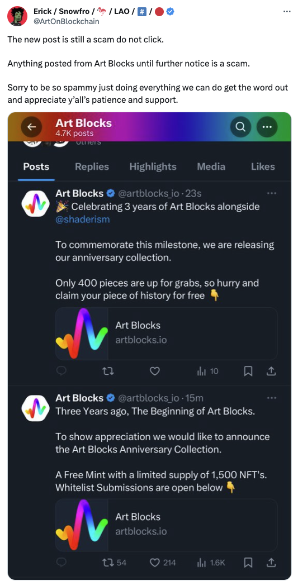
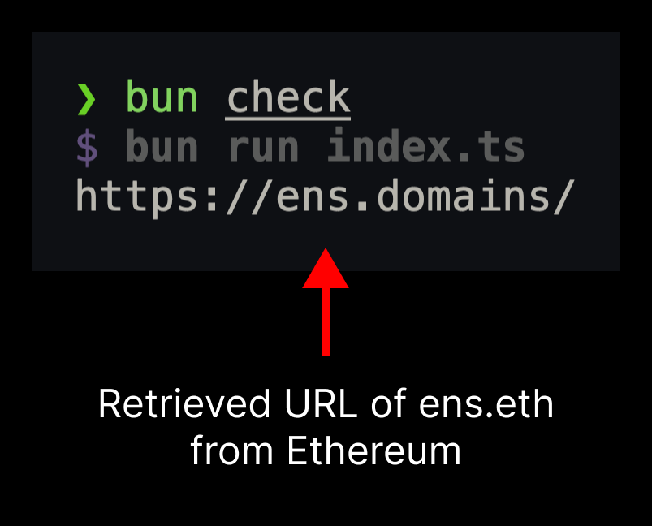
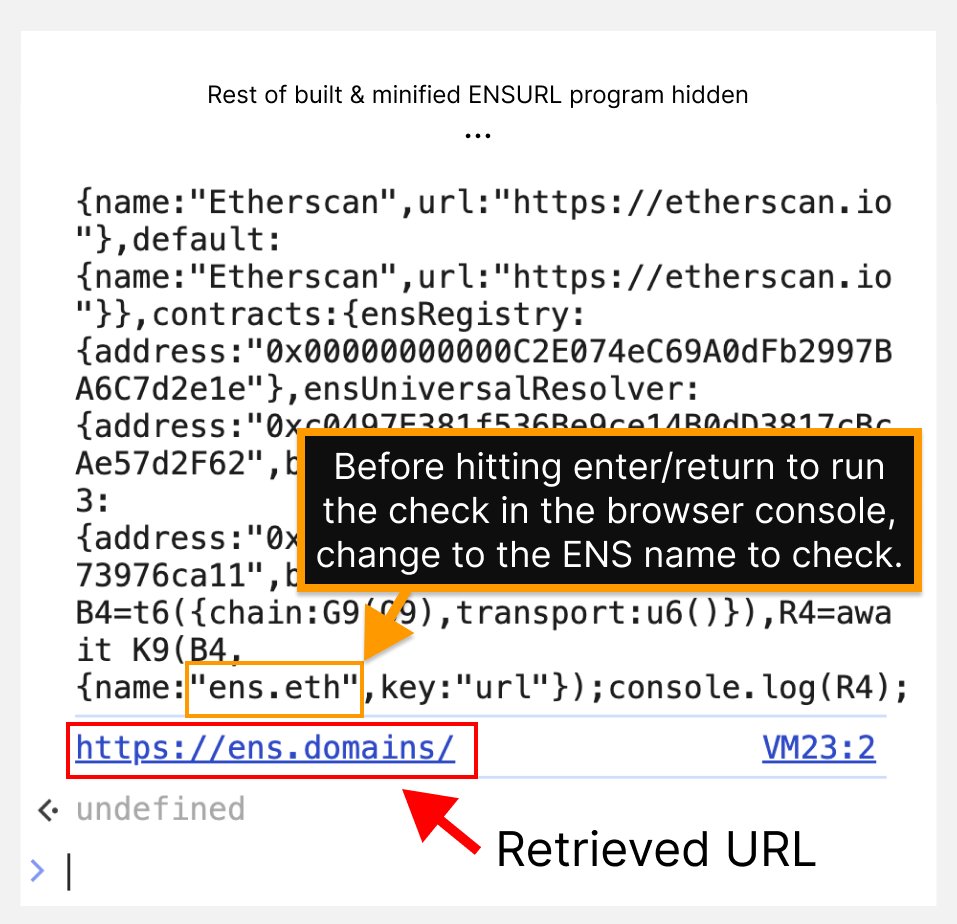

# ENSURL

Have you been warned to not click the link in a tweet because of potential wallet drainers? Don't trust the link is the correct URL, *verify* with ENSURL.

---

<div align="center" style={{""}}>
<h2 style={{""}}>Example of a Fake/Malicious Link (12/19/2023)</h2>

</div>

---

## Check URL Text Record [↗](./index.ts)

```typescript
import { addEnsContracts } from "@ensdomains/ensjs";
import { getTextRecord } from "@ensdomains/ensjs/public";
import { createPublicClient, http } from "viem";
import { mainnet } from "viem/chains";

const client = createPublicClient({
  chain: addEnsContracts(mainnet),
  transport: http(),
});
const url = await getTextRecord(client, {
  name: "ens.eth",
  key: "url",
});
console.log(url);
```

---

## Using ENSURL

### Option 1

1. Clone the repository.
2. Install dependencies with `bun install`.
3. Update .eth name in `index.ts` to the desired name to have URL fetched.
4. Run `bun check` to view the URL in the console.

### Server/Runtime Demo

<div align="center" style={{""}}>

</div>

## Option 2

1. Open up a new tab of a browser like Chrome, Brave or Firefox.
2. Copy and paste the entire contents of `out/index.js` into the console.
3. Update the default `"ens.eth"` name to the ENS name you want to check.
4. Once updated, hit enter or return and wait for the URL to be fetched from Ethereum. You should see the URL printed on the next line in your browser console.

<div align="center" style={{""}}>
<p style={{""}}><em style={{""}}>Check the demo below to understand the instructions better.</em></p>
</div>

### Browser Demo

<div align="center" style={{""}}>

</div>
